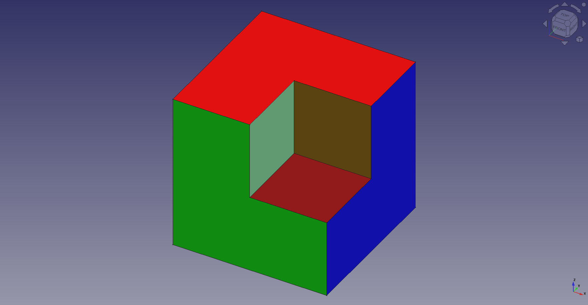

<!-- SPDX-License-Identifier: CC-BY-SA-4.0 -->
<!-- SPDX-FileNotice: Part of the Supplemental Materials addons. -->

# Supplemental Materials

A materials database that supplements the core 
materials provided by the FreeCAD application.

 

The FreeCAD material system is designed to 
handle a wide range of materials. While 
the FreeCAD application comes with a core set 
of predefined materials, these were never 
intended to limit the materials you could 
describe or use in you FreeCAD designs. New 
materials will be added here instead of as 
part of the FreeCAD application.

By using this repository you'll get the latest 
materials as they become available.

## Information
» [Adding materials][Usage]  
» [Details about the material licenses][Licensing]  

[Licensing]: https://github.com/FreeCAD/SupplementalMaterials/wiki/Licensing
[Usage]: https://github.com/FreeCAD/SupplementalMaterials/wiki/Usage
